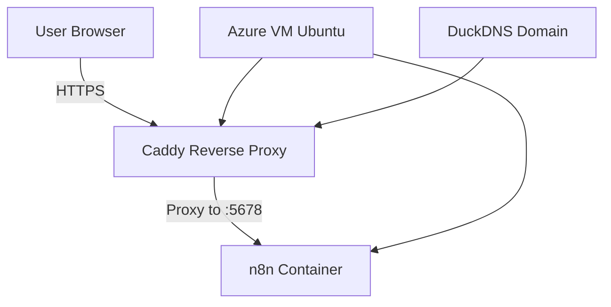

# Hosting n8n on Microsoft Azure Using Docker & Caddy

This guide provides a complete, professional walkthrough of deploying **n8n** on a Microsoft Azure Virtual Machine using **Docker**, **Docker Compose**, and **Caddy** as a reverse proxy with HTTPS. It includes all steps from VM creation to accessing the n8n editor through a domain name, as well as real issues encountered and how they were resolved.

---

## Table of Contents

1. [Overview](#overview)
2. [Prerequisites](#prerequisites)
3. [Step 1 — Create Azure Virtual Machine](#step-1--create-azure-virtual-machine)
4. [Step 2 — Connect to the VM](#step-2--connect-to-the-vm)
5. [Step 3 — Install Dependencies](#step-3--install-dependencies)
6. [Step 4 — Set Up n8n With Docker Compose](#step-4--set-up-n8n-with-docker-compose)
7. [Step 5 — Set Up Caddy Reverse Proxy](#step-5--set-up-caddy-reverse-proxy)
8. [Step 6 — Configure DNS](#step-6--configure-dns)
9. [Step 7 — Start Services](#step-7--start-services)
10. [Troubleshooting & Errors Encountered](#troubleshooting--errors-encountered)
11. [Security Recommendations](#security-recommendations)
12. [Credits](#credits)

---

## Overview

You will:

* Deploy an Ubuntu VM in Azure
* Install Docker & Docker Compose
* Run **n8n** in a Docker container
* Use **Caddy** to provide automatic HTTPS via Let's Encrypt
* Access your n8n instance via **[https://your-domain.com](https://your-domain.com)**

---

## Prerequisites

* An Azure account
* A domain name (any registrar)
* Basic Linux & SSH familiarity

---

## Step 1 — Create Azure Virtual Machine

1. Log in to **Azure Portal**.
2. Create a **Virtual Machine**:

   * Image: **Ubuntu 22.04 LTS**
   * Size: Standard B1s or higher
   * Authentication: SSH key recommended
3. Networking:

   * Open ports: **22**, **80**, **443**
4. Create and launch the VM.

---

## Step 2 — Connect to the VM

Use SSH from your terminal:

```bash
ssh azureuser@YOUR_VM_PUBLIC_IP
```

Update system:

```bash
sudo apt update && sudo apt upgrade -y
```

---

## Step 3 — Install Dependencies

### Install Docker

```bash
curl -fsSL https://get.docker.com | sudo bash
sudo usermod -aG docker $USER
```

Reboot or re-login.

### Install Docker Compose

```bash
sudo apt install docker-compose-plugin -y
```

### Install Caddy

```bash
sudo apt install -y debian-keyring debian-archive-keyring
curl -1sLf 'https://dl.cloudsmith.io/public/caddy/stable/gpg.key' | sudo tee /usr/share/keyrings/caddy-stable-archive-keyring.gpg >/dev/null
curl -1sLf 'https://dl.cloudsmith.io/public/caddy/stable/debian.deb.txt' | sudo tee /etc/apt/sources.list.d/caddy-stable.list
sudo apt update
sudo apt install caddy -y
```

---

## Step 4 — Set Up n8n With Docker Compose

Create project folder:

```bash
mkdir ~/n8n
cd ~/n8n
```

Create `docker-compose.yml`:

```yaml
version: "3.8"
services:
  n8n:
    image: n8nio/n8n
    restart: always
    ports:
      - "5678:5678"
    environment:
      - N8N_PORT=5678
      - WEBHOOK_URL=https://your-domain.com/
      - N8N_PROTOCOL=https
      - N8N_HOST=your-domain.com
    volumes:
      - ./data:/home/node/.n8n
```

Start n8n:

```bash
docker compose up -d
```

Verify it's running:

```bash
docker ps
```

---

## Step 5 — Set Up Caddy Reverse Proxy

Edit Caddy config:

```bash
sudo nano /etc/caddy/Caddyfile
```

Add:

```
your-domain.com {
    reverse_proxy localhost:5678
}
```

Save & restart Caddy:

```bash
sudo systemctl restart caddy
```

Caddy automatically issues an HTTPS certificate.

---

## Step 6 — Configure DNS

Go to your domain registrar (Namecheap, Cloudflare, etc.).

Add A record:

| Type | Host | Value             | TTL  |
| ---- | ---- | ----------------- | ---- |
| A    | @    | YOUR_VM_PUBLIC_IP | Auto |

Wait 5–15 minutes.

---

## Step 7 — Start Services

Visit:

```
https://your-domain.com
```

Your n8n editor should load.

---

## Troubleshooting & Errors Encountered

### ❗ Error: Port 80 Already in Use

When checking:

```bash
sudo lsof -i :80
```

Output:

```
docker-pr ... TCP *:http (LISTEN)
```

**Meaning**: A Docker container was already using port 80.

**Fix**:

* Identify container: `docker ps`
* Stop it: `docker stop <ID>`
* Free the port, then restart Caddy.

### ❗ Caddy Not Issuing SSL Certificate

Causes:

* DNS not propagated
* Port 80 blocked

Fix:

* Ensure Azure Network Security Group allows ports 80 & 443
* Wait up to 10 mins for DNS changes

### ❗ n8n Not Loading After Proxy Setup

Cause:

* Missing environment variables (HOST, PROTOCOL, WEBHOOK_URL)

Fix:
Add proper environment values inside Docker Compose.

---

## Security Recommendations

* Use a firewall (UFW) allowing only 22, 80, 443
* Enable Fail2Ban for SSH
* Use Azure-managed backups for persistence
* Store secrets using n8n credentials, not environment variables

---

## Credits

This deployment guide is based on real debugging done while hosting n8n via Docker and Caddy on Azure, including port conflicts, DNS propagation delays, and SSL issues.

---

**This document is ready for use in your GitHub repository.**

---

# 📌 TL;DR (Quick Summary)

* Create Azure VM → Install Docker & Docker Compose → Set up **n8n** + **Caddy** reverse proxy → Configure DuckDNS domain → Bring containers up → Enjoy secure HTTPS hosting.
* Common issues include Docker conflicts, port 80 already in use, outdated Docker Compose, or DuckDNS not updating.

---

# 📊 System Architecture (Diagram)



---

# 🚀 Quick Deploy Script (Simplifies Setup)

```bash
# Update & install Docker
sudo apt update && sudo apt upgrade -y
curl -fsSL https://get.docker.com -o get-docker.sh
sudo sh get-docker.sh
sudo usermod -aG docker $USER

# Install Docker Compose Plugin
sudo apt install docker-compose-plugin -y

# Create directories
mkdir ~/n8n && cd ~/n8n

# Pull n8n
sudo docker compose pull n8n

# Start stack
sudo docker compose up -d
```

---

# 🩺 Troubleshooting Table

| Issue                               | Cause                             | Fix                                                         |
| ----------------------------------- | --------------------------------- | ----------------------------------------------------------- |
| Port 80 already in use              | Old Caddy container still running | `sudo docker rm -f <container>` then `docker compose up -d` |
| n8n version not updating            | Old container still exists        | Remove container + recreate stack                           |
| DuckDNS domain not resolving        | IP not updated                    | Force update via DuckDNS token URL                          |
| Caddy reload stuck                  | Wrong JSON config                 | Validate with `caddy validate --config`                     |
| Workflow node can't fetch workflows | Cloud-only feature                | Not available in self-hosted                                |

---

# 📝 License

```
MIT License
```

---

# 👥 Credits

* Author: BRUCE
* Reference: ChatGPT
* Hosting Stack: Docker, Caddy, n8n, Azure VM
